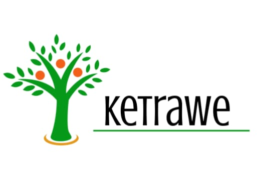
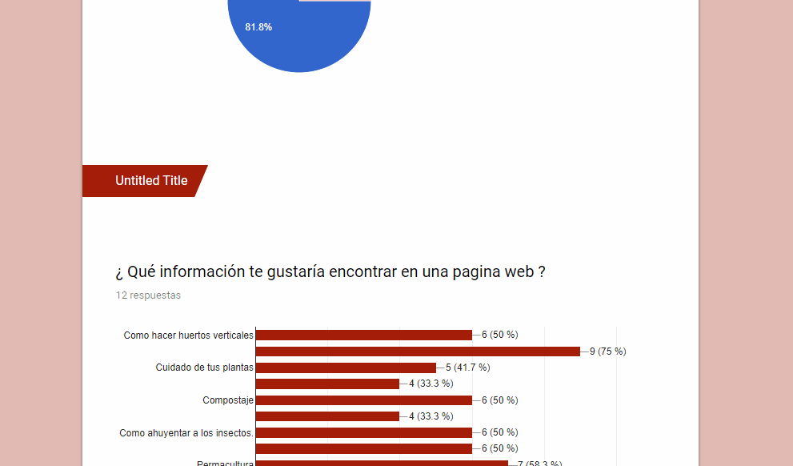
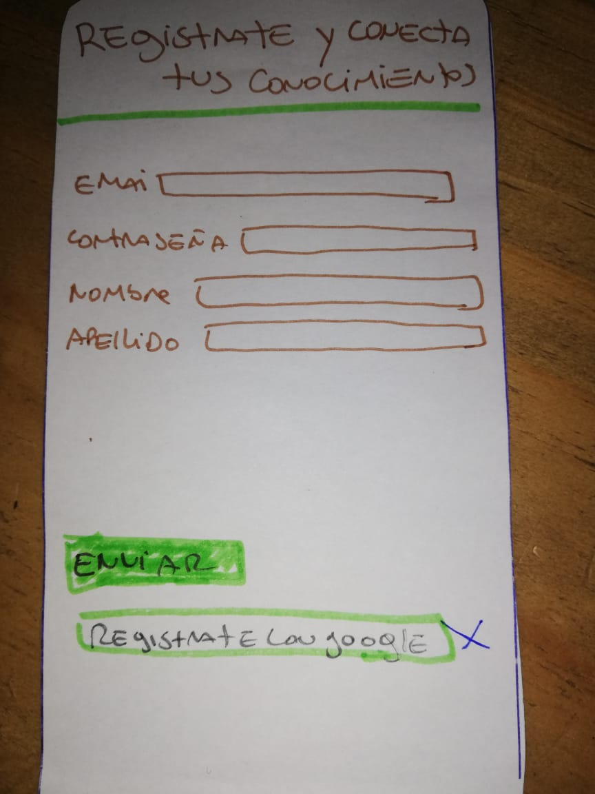
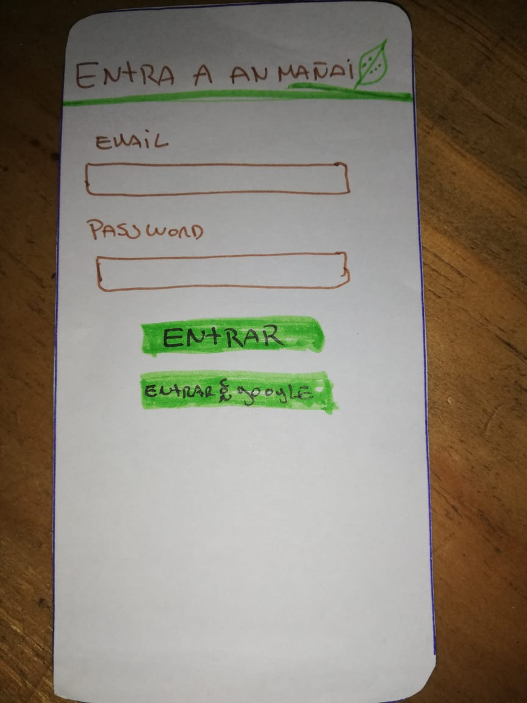
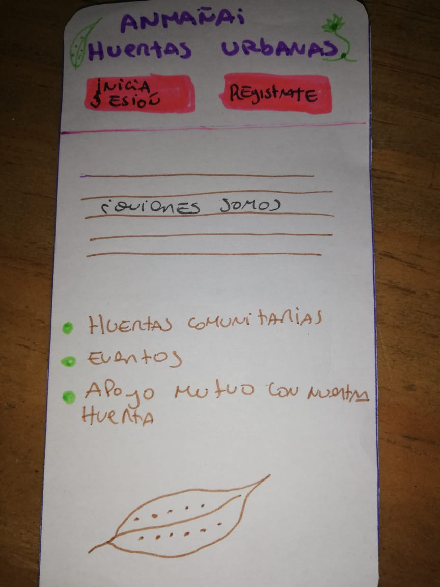
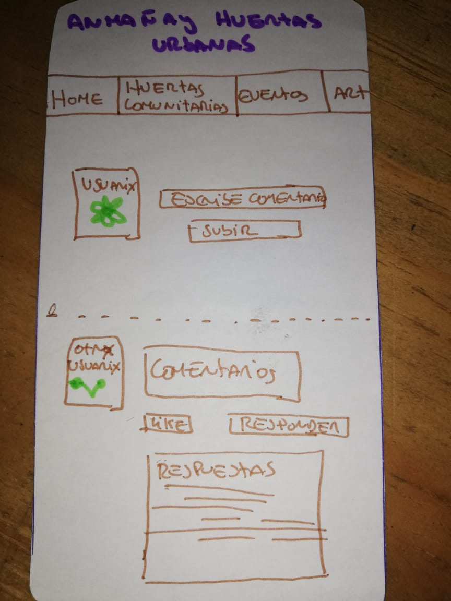
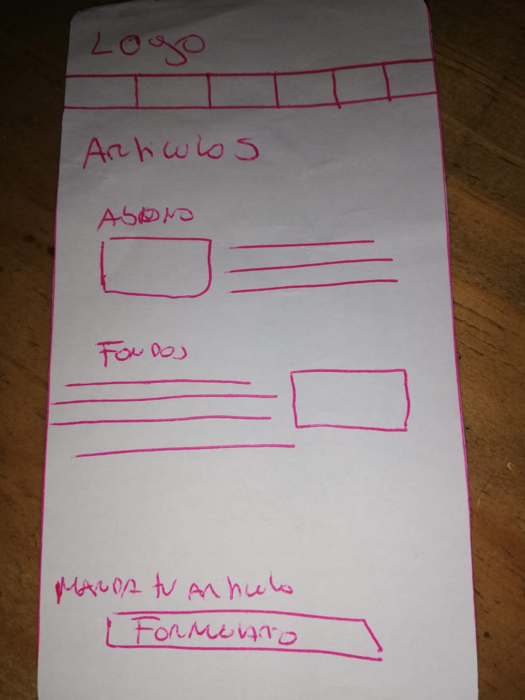
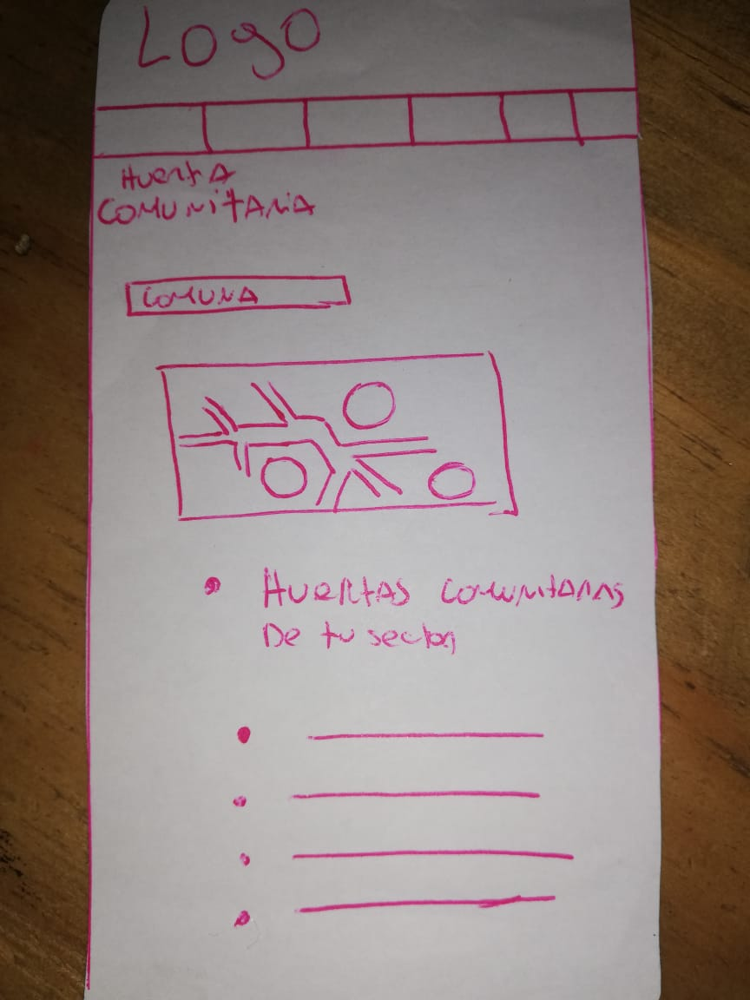

# ketrawe 
Su significado es tierra cultivable, esta aplicación busca ser una constribución en el respeto y el amor por la tierra y su poder, llamando a la colectividad y el conocimiento  desde lo que hoy llamamos huertas; huerta como un modo de autonomia alimentaria y de conección.
ketrawue es una red social de seres humanes que cultivan de distintas maneras, donde podran exponer dudas y también aprendizajes de su experiencia, junto con esto compartir actividades, compartir semilas y alimentos. tendran un espacio donde se podran contactar y encontrar con huertas comunitarias de su sector  y asi  apoyar en su crecimiento.

### Usuaries
Esta pensada para personas desde los 15 años hasta la edad que sea, que tengan una huerta o pretendan  empezar con una, son usuaries normalmente informades y que creen en el trabajo colectivo y solidario de la creación de estos espcios.
####encuesta usuaries.

### prototipo de baja calidad

### prototipo de alta fidelidad de primera historia de usuario 

https://www.figma.com/file/CDuIdQKMe5PaB9YEXKvo0lAu/Untitled?node-id=0%3A1

### Como fuimos plaificandonos en Trello

https://trello.com/b/Mqlz9FJI/red-social

### Historias de usuario

1. COMO amante de las plantas QUIERO crear una cuenta en la página PARA poder ingresar a la comunidad de forma segura
Criterios de aceptación.
    • Permitir al usuario registrarse con su nombre, correo y contraseña.
    • Generar mensaje de error si olvida rellenar algún campo.
    • Generar mensaje de error si el correo es inválido.
    • Generar mensaje de error cuando ingrese una contraseña menor a 6 caracteres.
    • Cuando el usuario crea la cuenta, debe recibir un correo de verificación.

2. COMO usuario registrado en el formulario QUIERO ingresar a la página PARA navegar por ella.

Criterios de aceptación.
    • Campo para ingresar correo
    • Campo para ingresar contraseña.
-Generar un mensaje de alerta cuando el usuario no ingrese uno de los campos requeridos.
-Generar un mensaje de alerta cuando el usuario ingrese un campo incorrecto o no valido 
    • Botón “comenzar” para iniciar.
    • Poder visualizar la página.
    • Poder ver mi imagen de perfil.
    • Poder cerrar sesión .
    
3. COMO amante de las plantas QUIERO iniciar sesión con google PARA poder ingresar a la comunidad de forma segura

Criterios de aceptación :
   - Permitir al usuario ingresar con su cuenta de google
   - Permitir que el usuario ingrese una contraseña si es que aun no ha iniciado sesión en google.
   - Poder visualizar la página.
   -  Poder ver mi imagen de perfil
   -  Poder comentar y escribir en la pagina.
   - Poder cerrar sesión ...con el boton…..

Definición de terminado:
- Debe ser una SPA.
- Debe ser responsive.
- Debes haber recibido code review de al menos una compañera de otro equipo.
- Haces test unitarios y, además, has testeado tu producto manualmente.
- Hiciste pruebas de usabilidad e incorporaste el feedback del usuario.

4. COMO usuario amante de las plantas QUIERO publicar en el muro PARA poder resolver mis dudas o compartir experiencias

Criterios de aceptación :
    • Permitir al usuario registrado escribir en el muro
-Poder ver su foto de perfil al lado del comentario que quiero escribir.
      (testear las dos opciones, con registro y sin registro)
-Poder ver junto a los comentarios del muro , los nombres de los usuarios que escribieron 
    • Tener botón “comentar”.
    • Luego de comentar poder visualizar su mensaje en el muro.
    • Poder visualizar los comentarios de los otros usuarios.

5. COMO usuario amante de las plantas QUIERO Editar y eliminar mis publicaciones PARA corregir lo escrito.
Criterios de aceptación :
-Poder eliminar un post especifico. Con un botón "eliminar"
-Pedir confirmación antes de eliminar un post.
-Permitir al usuario editar el post que haya colocado en el muro con un botón "editar"
    • Generar mensaje de alerta para usuario que intente escribir y no este registrado
    • Tener botón “comentar”
    • Luego de comentar poder visualizar su mensaje en el muro.
    • Poder visualizar los comentarios de los otros usuarios.

6. Como usuario Quiero dar, quitar y contar like a las diferentes publicaciones que están escritas en el muro PARA confirmar que algo me gustó, ver otras y llevar un conteo.
Criterios de aceptación :
-Poder visualizar icono de like en cada publicación para poder pinchar sobre este.
-Poder dar like a las diferentes publicaciones.
-Poder quitar like a las diferentes publicaciones.
- Llevar un conteo de los likes.
-Poder visualizar cual fue el usuario que le dio like a una publicación. (HE)

7. Como usuario QUIERO moverme dentro del menú PARA ver diferentes secciones de la pagina.

- Menú visible en la parte superior de forma horizontal.
- Menú con acceso a cada sección.

8. Como usuario de la aplicación QUIERO poder visualizar los lugares donde puedo encontrar huertas comunitarias
Criterios de aceptación :
-Poder ingresar a la sección de huertas comunitarias .
-Poder elegir entre las opciones de lugares dentro de la región metropolitana y escoger la opción que más le acomode .
-Poder visualizar el resultado de la selección del lugar donde quiere ver donde existen huertas comunitarias . (guardar en json)

9. COMO usuario registrado QUIERO Comentar otras publicaciones PARA poder interactuar con otros usuarios.

Criterios de aceptación :
- Poder visualizar las publicaciones de los usuarios.
- Espacio para introducir el comentario
-Contar con botón “comentar”
-Visualizar comentario escrito. 

